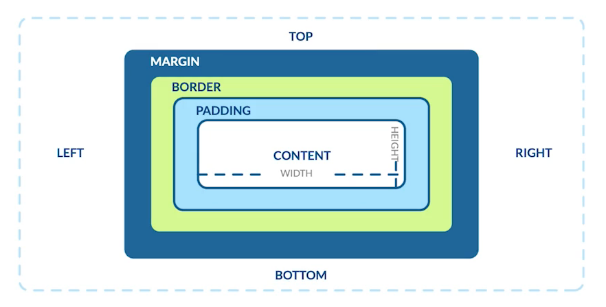
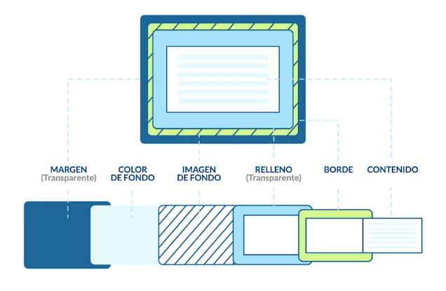
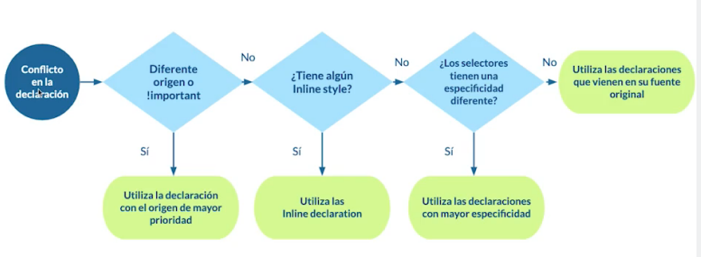
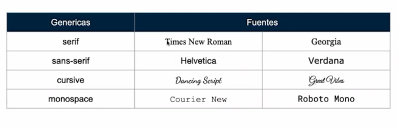
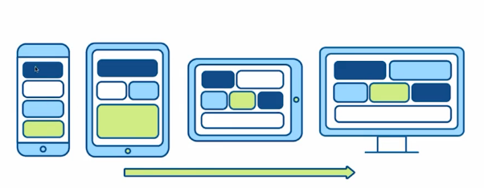
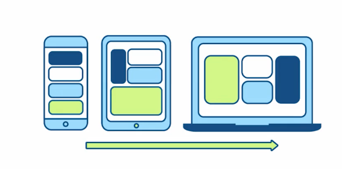
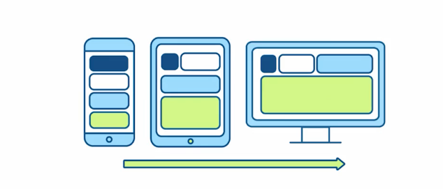

# HTML_course
HTML Course by Platzi

**Content**

* [Web Developer Fundamentals](https://github.com/isabelyb/HTML_course#web-developer-fundamentals)
* [HTML: anatomía de una página web](https://github.com/isabelyb/HTML_course#html-anatom%C3%ADa-de-una-p%C3%A1gina-web)
* [Etiquetas Multimedia](https://github.com/isabelyb/HTML_course#etiquetas-multimedia)
* [Formularios](https://github.com/isabelyb/HTML_course#formularios-form)
* [CSS](https://github.com/isabelyb/HTML_course#css---cascading-style-sheet)

## Web Developer Fundamentals

El **Frontend** debe saber de código que entienda el navegador (HTML, CSS y JavaScript) para poder usar algunos frameworks o librerías que expanden sus capacidades para crear cualquier tipo de interfaces de usuarios. React, Redux, Angular, Bootstrap, Foundation, LESS, Sass, Stylus y PostCSS son algunos de ellos.

El **Backend** trabaja en el lado del servidor, es el responsable de manejar toda la lógica que hay detrás de una petición dada por el navegador hacia el servidor. Usa varios lenguajes de programación (Node.js, Python, PHP, Ruby, GO, Java, .NET entre otros) Cada uno de estos lenguajes tiene sus propios frameworks como:

- Django (Python)
- Lavarel (PHP)
- Rails (Ruby)
- Express (JavaScript)
- Spring (Java)

El **Backend** también tiene en cuenta la infraestructura donde va a realizarse el deploy de su aplicación (esto también puede ser tarea de un **DevOps**, un perfil dedicado a la infraestructura), con tecnologías como:

- Google Cloud
- DigitalOcean
- AWS
- Heroku

### ¿Qué es deploy?

Puede significar muchas cosas, dependiendo del ambiente y de la tecnología usada. Sin embargo, los significados que más se refieren a la práctica y pueden resumir su función son: implantar, colocar en posición, habilitar para uso o, simplemente, publicar.

**Bases de datos** son las encargadas de almacenar toda la información del proyecto. Los principales tipos son:

Bases de datos relacionales (MySQL. Postgres)
Bases de datos no relacionales (mongoDB)


## HTML: anatomía de una página web

HTML (HyperText Markup Language) es un lenguaje de marcado de texto. Se utiliza para darle una estructura al sitio web que estás visitando.

Estructura básica de HTML en una página Web

* **Container:** contenedor principal
* **Header:** cabecera de la página. Aquí usualmente encuentras el logo y el menú de navegación del sitio.
* **Main content:** estructura principal. Por ejemplo, el feed o lista de publicaciones de una red social.
* **Sidebar:** contenido secundario de una página, que usualmente se encuentra a los lados del contenido principal (o main).
* **Footer:** pie de página. Esto se encuentra al fondo del sitio web, salvo en casos de sitios web donde el scroll (o navegación hacia abajo) es infinito, por ende, no tendría sentido ponerlo al fondo.

### Index y su estructura básica: Head

En el **head** van todos los archivos importantes para que el proyecto funcione correctamente, algunos como: Estilos, fuentes, descripciones, librerías.
Es la parte no visible de la página.

### Index y su estructura básica: Body

El **body** es la etiqueta que identifica la parte visible del sitio web.

* Etiquetas contenedoras: Llevan etiquetas dentro y generan la estructura de sitio web.
    * **header**: cabecera del documento.
    * **nav**: para hacer menús de navegación.
    * **main**: debajo del header, contenido principal.
    * **footer**: pie de página del documento.
    * **section**: sirve para diferenciar las secciones principales del contenido.
    * **article**: diferencia partes del contenido independientes.
    * **ul y ol**: listas de items. (ul) No ordenada  (ol) Ordenada.
    * **figure**: le da un contexto semántico a las imágenes, genera un contenedor para las imágenes.

* Etiquetas de contenido: Llevan texto, video, imágenes... cualquier cosa que se pueda renderizar en el navegador.
    * **li**: List item. Dentro de ul y ol.
    * **aside**: contenido menos relevante, como publicidad, etc.
    * **h1 - h6**: para indicar títulos con un estilo que destaca del resto.
    * **table**: tablas de contenidos, similar a la estructura de las hojas de calculo.
    * **div**: cualquier división para organizar el contenido.
    * **p**: define el texto de un párrafo.
    * **small**: aplica una apariencia de texto reducido en tamaño.
    * **strong**: aplica al texto un formato de negritas.
    * **a**: corresponde a un ancla o enlace a una url interna o externa del documento.
    * **img**: enlazar imágenes en el documento.

💡 Es muy importante usar HTML semántico y no llenar todo de ```<div>``` para que el sitio sea mejor interpretado por el navegador y, por lo tanto, más accesible.

➡️ [Code here](https://github.com/isabelyb/HTML_course/tree/main/HTML/index)

### Anatomía de una etiqueta de HTML

Una etiqueta HTML puede tener tantos atributos como desees, y cada atributo tiene su propia función.


## Etiquetas Multimedia

### Tipos de imágenes para web
* **Lossless** (sin pérdida): Capturan todos los datos del archivo original. No se pierde nada del archivo original.
Puede comprimirse, pero podrá reconstruir su imagen al estado original.
* **Lossy** (con pérdida): Se aproximan a su imagen original. Podría reducir la cantidad de colores en su imagen o analizar la imagen en busca de datos innecesarios. Por consiguiente puede reducir su tamaño, lo que mejora el tiempo de carga de la página, pero pierde su calidad. Los archivos tipo lossy son mucho más livianos que los archivos tipo lossless, por lo que son ideales para usar en sitios en donde el tamaño del archivo y la velocidad de descarga son importantes.

    

💡 Tamaño máximo recomendado para una imágen: 70kb

Herramientas para optimizar imágenes:

* **Tiny PNG**: Comprime el tamaño de una imagen, para hacerla más ligera.

* **Verefix**: Elimina los metadatos de una imagen, para reducir su tamaño.

### Etiqueta ``````

* `````` incrusta una imagen dentro de un documento: Va siempre dentro del contenedor ```<body>```, pues es un elemento visible.
* Atributo ```src```: ruta de donde se tomará la imagen.
* Atributo ```alt```: Se usa para dar una descripción de la imagen, es muy importante en accesibilidad.
    ``````
* ```<figcaption>```: permite darle una pequeña descripción a la imagen, como el autor, fuente o algo por el estilo, que se mostrará usualmente abajo de la imagen.

    ➡️ [Code here](https://github.com/isabelyb/HTML_course/tree/main/HTML/img_tag)


💡 Siempre `````` dentro de ```<figure>``` para darle contexto semántico a la imagen y poder posicionarla dentro del sitio web.

```<figure>``` representa contenido independiente, a menudo con un título. Por lo general, se trata de una imagen, una ilustración, un diagrama, un fragmento de código, o un esquema al que se hace referencia en el texto principal, pero que se puede mover a otra página o a un apéndice sin que afecte al flujo principal.


### Etiqueta ```<video>```
* Atributo ```src```: ruta de donde se tomará el video. Con ```#t=3,10``` empieza en el segundo 3 y termina en el segundo 10.
* Atributo ```controls```: agrega al video los controles necesarios para reproducir, pausar y adelantar.
* Atributo ```preload = auto```: hace que el navegador descargue el video, en el momento en el que se acceda a la página.


    ➡️ [Code here](https://github.com/isabelyb/HTML_course/tree/main/HTML/video_tag)


## Formularios ```<form>```

>"El mejor formulario, es el que no existe"

* Atributo ```action="">```: Cuando se interactura con el formulario y js para enviar informacion, dentro de este se colocala la url o el endpoint que es la url donde se envia la informacion a la Base de datos.
* ```<label for="">```: Aquí el nombre del input, que será el mismo ```id``` en la etiqueta ```<input>```.
* ```<input type="date" id="">```: Tipo date es el tipo para marcar un fecha.
* ```<input type="text" id="nombre" placeholder="Your name">```: El atributo placeholder poner un texto de ejemplo que visualmente le dice a la persona que llena el formulario que tipo de informacion deberia de ir en esa parte.

    ➡️ [Code here "Forms"](https://github.com/isabelyb/HTML_course/tree/main/HTML/forms)  
    ➡️ [Code here "Calendar"](https://github.com/isabelyb/HTML_course/tree/main/HTML/calendar)     
    ➡️ [Code here "Button"](https://github.com/isabelyb/HTML_course/tree/main/HTML/button)

## CSS - Cascading style sheet

Es la herramienta con la que se le da estilo a un sitio web: color, tamaño, espacios, lugares de posición.


💡 BEM CSS es una metodología de nomenclatura para [definir las clases en los nodos HTML del documento](https://en.bem.info/methodology/faq/#why-bem).

* Una **pseudoclase CSS** es una palabra clave que se añade a los selectores y que especifica un estado especial del elemento seleccionado. 
    [Lista de pseudoclases](https://developer.mozilla.org/es/docs/Web/CSS/Pseudo-classes)

* Los **pseudo-elementos** se añaden a los selectores, pero en cambio, no describen un estado especial sino que, permiten añadir estilos a una parte concreta del documento. [Lista de pseudoelementos](https://developer.mozilla.org/es/docs/web/css/pseudo-elements)


    ➡️ [Code here "CSS Rules"](https://github.com/isabelyb/HTML_course/tree/main/CSS/general_css)  
    ➡️ [Code here "Pseudoclases y Pseudoelementos"](https://github.com/isabelyb/HTML_course/tree/main/CSS/pseudo_class)     


### Modelo de cajas





➡️ [Code here "Modelo de Cajas"](https://github.com/isabelyb/HTML_course/tree/main/CSS/box_model)


### ¿Cómo se controla el orden al declarar CSS? 

CSS y el navegador van a tener 3 puntos que son importantes para decidir que estilos se van a implementar.



### Fuentes Web




## Responsive Design

Son todas la técnicas que se usan para adaptar las aplicaciones web a la mayor cantidad de pantallas.

**Break points:** Son la dimensión en el viepor o with de la pantalla en la que se genera un cambio, este cambio es en el que se puede reposicionar o redimensionar los elementos y contenedores para que se pueda ver bien el sitio web sin importar el dispositivo.


💡 La tendencia es a desarrollar *mobile first* o *mobil only* sobre *desktop first*. Es decir, primero diseñar para celular, luego un break point para tablet y finalmente un break point para PC.

**Media Queries:** Para aplicar media queries con buenas prácticas, hay que hacerlo en el header. Porque así solo se descarga el código necesario según el dispositivo, mientras que en CSS se descarga todo sin importar nada.
```
@media (min-width: #;) {"código que se aplicará"}
```

### Responsive Web Design Patterns:

**Mostly Fluid:** consiste, principalmente, en una cuadrícula fluida. Por lo general, en las pantallas grandes o medianas se mantiene el mismo tamaño y simplemente se ajustan los márgenes en las más anchas.



**Layout Shifter:** El patrón Layout shifter es el más adaptable, ya que posee varios puntos de interrupción en diferentes anchos de pantalla.

La clave para este diseño es el desplazamiento del contenido, en lugar de su reprocesamiento y colocación debajo de otras columnas. Debido a las diferencias significativas entre cada punto de interrupción principal, es más complejo de mantener, y es posible que se deban realizar cambios dentro de los elementos, no solo en el diseño de contenido general.



**Column drop:** En el caso de los diseños con varias columnas de ancho completo, durante el proceso de colocación de columnas éstas únicamente se colocan de forma vertical debido a que el ancho de la ventana es demasiado reducido para el contenido.




## Accesibilidad

Productos para todos: Todas las personas pueden acceder al producto.

“La accesibilidad es una acto de democratización al acceso de productos digitales, es la reivindicación del derecho de una persona con ciertas capacidades diferentes a acceder a las mismas plataformas.”

### Semántica
La semántica está relacionada con las etiquetas contenedoras en HTML5, por ejemplo: header, main, sidebar y footer. Estas agregan información importante para aquellos que tengan problemas con la visualización de la página. Les permite a estos usuarios orientarse en qué sección de la página se encuentran.

⚠️ No abusar de las etiquetas ```div```

### Texto
Se recomienda fuertemente usar medidas relativas (REM, EM) , para poder incrementar el tamaño del texto para personas con visibilidad disminuida. Las opciones de navegador que cambian el tamaño de las fuentes no funcionan cuando las fuentes de html en el texto están en pixeles (px).

### Labels, alt y title
* El uso de ```<label>``` en los formularios facilita la interacción de las personas y software con ellos. Por ejemplo al apretar la barra de espacio en un input que despligue un submenú, este se mostrará.
* ```alt``` en las imágenes proporciona una descripción para un lector de contenido.
* El atributo ```title``` puede ser usado en las etiquetas `````` y a para dar una descripción de sus contenidos al hacer hover.
