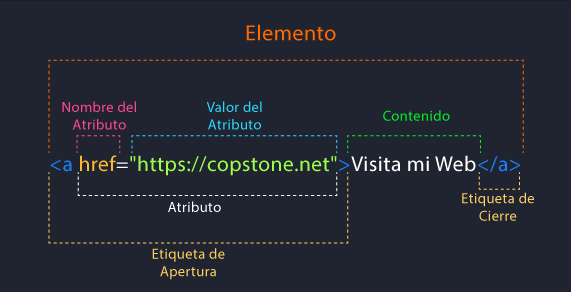
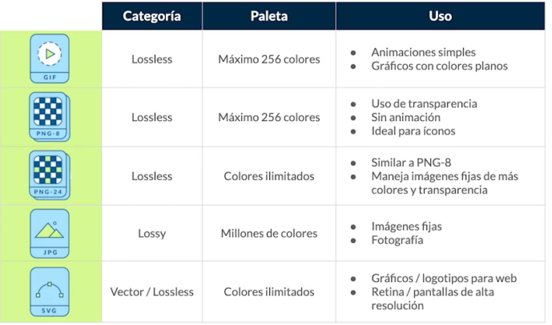

# HTML_course
HTML Course by Platzi

**Content**

* [Web Developer Fundamentals](https://github.com/isabelyb/HTML_course#web-developer-fundamentals)
* [HTML: anatomía de una página web](https://github.com/isabelyb/HTML_course#html-anatom%C3%ADa-de-una-p%C3%A1gina-web)
* [Etiquetas Multimedia](https://github.com/isabelyb/HTML_course#etiquetas-multimedia)
* [Formularios](https://github.com/isabelyb/HTML_course#formularios)

## Web Developer Fundamentals

El **Frontend** debe saber de código que entienda el navegador (HTML, CSS y JavaScript) para poder usar algunos frameworks o librerías que expanden sus capacidades para crear cualquier tipo de interfaces de usuarios. React, Redux, Angular, Bootstrap, Foundation, LESS, Sass, Stylus y PostCSS son algunos de ellos.

El **Backend** trabaja en el lado del servidor, es el responsable de manejar toda la lógica que hay detrás de una petición dada por el navegador hacia el servidor. Usa varios lenguajes de programación (Node.js, Python, PHP, Ruby, GO, Java, .NET entre otros) Cada uno de estos lenguajes tiene sus propios frameworks como:

- Django (Python)
- Lavarel (PHP)
- Rails (Ruby)
- Express (JavaScript)
- Spring (Java)

El **Backend** también tiene en cuenta la infraestructura donde va a realizarse el deploy de su aplicación (esto también puede ser tarea de un **DevOps**, un perfil dedicado a la infraestructura), con tecnologías como:

- Google Cloud
- DigitalOcean
- AWS
- Heroku

### ¿Qué es deploy?

Puede significar muchas cosas, dependiendo del ambiente y de la tecnología usada. Sin embargo, los significados que más se refieren a la práctica y pueden resumir su función son: implantar, colocar en posición, habilitar para uso o, simplemente, publicar.

**Bases de datos** son las encargadas de almacenar toda la información del proyecto. Los principales tipos son:

Bases de datos relacionales (MySQL. Postgres)
Bases de datos no relacionales (mongoDB)


## HTML: anatomía de una página web

HTML (HyperText Markup Language) es un lenguaje de marcado de texto. Se utiliza para darle una estructura al sitio web que estás visitando.

Estructura básica de HTML en una página Web

* **Container:** contenedor principal
* **Header:** cabecera de la página. Aquí usualmente encuentras el logo y el menú de navegación del sitio.
* **Main content:** estructura principal. Por ejemplo, el feed o lista de publicaciones de una red social.
* **Sidebar:** contenido secundario de una página, que usualmente se encuentra a los lados del contenido principal (o main).
* **Footer:** pie de página. Esto se encuentra al fondo del sitio web, salvo en casos de sitios web donde el scroll (o navegación hacia abajo) es infinito, por ende, no tendría sentido ponerlo al fondo.

### Index y su estructura básica: Head

En el **head** van todos los archivos importantes para que el proyecto funcione correctamente, algunos como: Estilos, fuentes, descripciones, librerías.
Es la parte no visible de la página.

### Index y su estructura básica: Body

El **body** es la etiqueta que identifica la parte visible del sitio web.

* Etiquetas contenedoras: Llevan etiquetas dentro y generan la estructura de sitio web.
    * **header**: cabecera del documento.
    * **nav**: para hacer menús de navegación.
    * **main**: debajo del header, contenido principal.
    * **footer**: pie de página del documento.
    * **section**: sirve para diferenciar las secciones principales del contenido.
    * **article**: diferencia partes del contenido independientes.
    * **ul y ol**: listas de items. (ul) No ordenada  (ol) Ordenada.
    * **figure**: le da un contexto semántico a las imágenes, genera un contenedor para las imágenes.

* Etiquetas de contenido: Llevan texto, video, imágenes... cualquier cosa que se pueda renderizar en el navegador.
    * **li**: List item. Dentro de ul y ol.
    * **aside**: contenido menos relevante, como publicidad, etc.
    * **h1 - h6**: para indicar títulos con un estilo que destaca del resto.
    * **table**: tablas de contenidos, similar a la estructura de las hojas de calculo.
    * **div**: cualquier división para organizar el contenido.
    * **p**: define el texto de un párrafo.
    * **small**: aplica una apariencia de texto reducido en tamaño.
    * **strong**: aplica al texto un formato de negritas.
    * **a**: corresponde a un ancla o enlace a una url interna o externa del documento.
    * **img**: enlazar imágenes en el documento.

💡 Es muy importante usar HTML semántico y no llenar todo de ```<div>``` para que el sitio sea mejor interpretado por el navegador y, por lo tanto, más accesible.

➡️ [Code here](https://github.com/isabelyb/HTML_course/tree/main/HTML/index)

### Anatomía de una etiqueta de HTML

Una etiqueta HTML puede tener tantos atributos como desees, y cada atributo tiene su propia función.




## Etiquetas Multimedia

### Tipos de imágenes para web
* **Lossless** (sin pérdida): Capturan todos los datos del archivo original. No se pierde nada del archivo original.
Puede comprimirse, pero podrá reconstruir su imagen al estado original.
* **Lossy** (con pérdida): Se aproximan a su imagen original. Podría reducir la cantidad de colores en su imagen o analizar la imagen en busca de datos innecesarios. Por consiguiente puede reducir su tamaño, lo que mejora el tiempo de carga de la página, pero pierde su calidad. Los archivos tipo lossy son mucho más livianos que los archivos tipo lossless, por lo que son ideales para usar en sitios en donde el tamaño del archivo y la velocidad de descarga son importantes.

    

💡 Tamaño máximo recomendado para una imágen: 70kb

Herramientas para optimizar imágenes:

* **Tiny PNG**: Comprime el tamaño de una imagen, para hacerla más ligera.

* **Verefix**: Elimina los metadatos de una imagen, para reducir su tamaño.

### Etiqueta ``````

* `````` incrusta una imagen dentro de un documento: Va siempre dentro del contenedor ```<body>```, pues es un elemento visible.
* Atributo ```src```: ruta de donde se tomará la imagen.
* Atributo ```alt```: Se usa para dar una descripción de la imagen, es muy importante en accesibilidad.
    ``````
* ```<figcaption>```: permite darle una pequeña descripción a la imagen, como el autor, fuente o algo por el estilo, que se mostrará usualmente abajo de la imagen.

    ➡️ [Code here](https://github.com/isabelyb/HTML_course/tree/main/HTML/img_tag)


💡 Siempre `````` dentro de ```<figure>``` para darle contexto semántico a la imagen y poder posicionarla dentro del sitio web.

```<figure>``` representa contenido independiente, a menudo con un título. Por lo general, se trata de una imagen, una ilustración, un diagrama, un fragmento de código, o un esquema al que se hace referencia en el texto principal, pero que se puede mover a otra página o a un apéndice sin que afecte al flujo principal.


### Etiqueta ```<video>```
* Atributo ```src```: ruta de donde se tomará el video. Con ```#t=3,10``` empieza en el segundo 3 y termina en el segundo 10.
* Atributo ```controls```: agrega al video los controles necesarios para reproducir, pausar y adelantar.
* Atributo ```preload = auto```: hace que el navegador descargue el video, en el momento en el que se acceda a la página.


    ➡️ [Code here](https://github.com/isabelyb/HTML_course/tree/main/HTML/video_tag)


## Formularios ```<form>```

>"El mejor formulario, es el que no existe"

* Atributo ```action="">```: Cuando se interactura con el formulario y js para enviar informacion, dentro de este se colocala la url o el endpoint que es la url donde se envia la informacion a la Base de datos.
* ```<label for="">```: Aquí el nombre del input, que será el mismo ```id``` en la etiqueta ```<input>```.
* ```<input type="date" id="">```: Tipo date es el tipo para marcar un fecha.
* ```<input type="text" id="nombre" placeholder="Your name">```: El atributo placeholder poner un texto de ejemplo que visualmente le dice a la persona que llena el formulario que tipo de informacion deberia de ir en esa parte.

    ➡️ [Code here](https://github.com/isabelyb/HTML_course/tree/main/HTML/forms)